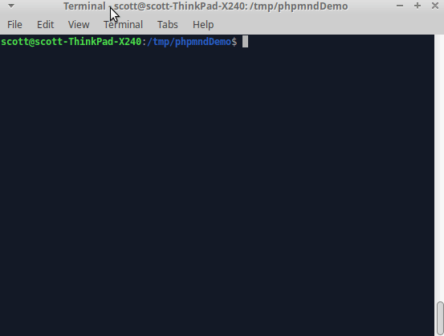

# PHP Magic Number Detector (PHPMND)

[](https://packagist.org/packages/povils/phpmnd)
[](https://scrutinizer-ci.com/g/povils/phpmnd/?branch=master)
[](https://packagist.org/packages/povils/phpmnd)
[](https://github.com/povils/phpmnd)

`phpmnd` is a tool that aims to **help** you to detect magic numbers in your PHP code. By default 0 and 1 are not considered to be magic numbers.

## What is a magic number?
A magic number is a numeric literal that is not defined as a constant, but which may change at a later stage, and therefore can be hard to update. It's considered a bad programming practice to use numbers directly in any source code without an explanation. In most cases this makes programs harder to read, understand, and maintain.

Consider the following hypothetical code:

```php
class Foo
{
    public function setPassword($password)
    {
         // don't do this
         if (mb_strlen($password) > 7) {
              throw new InvalidArgumentException("password");
         }
    }
}
```
which should be refactored to:
```php
class Foo
{
    const MAX_PASSWORD_LENGTH = 7; // not const SEVEN = 7 :)

    public function setPassword($password)
    {
         if (mb_strlen($password) > self::MAX_PASSWORD_LENGTH) {
              throw new InvalidArgumentException("password");
         }
    }
}
```
This clearly improves the code readability and also reduces its maintenance cost.

Of course not every literal number is a magic number.
```php
$is_even = $number % 2 === 0
```
Surely in this case the number 2 is not a magic number.

***My rule of thumb:***
```
If the number came from business specs and is used directly - it's a magic number.
```
## Installation

### Locally

You can add this tool as a local, per-project, development dependency to your project by using [Composer](https://getcomposer.org/):

```bash
$ composer require --dev povils/phpmnd
```

Afterwards you can then invoke it using the `vendor/bin/phpmnd` executable.

### Globally
To install it globally simply run:

```bash
$ composer global require povils/phpmnd
```

Afterwards make sure you have the global Composer binaries directory in your ``PATH``. Example for some Unix systems:

```bash
$ export PATH="$PATH:$HOME/.composer/vendor/bin"
```

## Usage Example

#### Demo



#### Basic usage

```bash
$ phpmnd wordpress --ignore-numbers=2,-1 --ignore-funcs=round,sleep --exclude=tests --progress \
--extensions=default_parameter,-return,argument
```

The ``--allow-array-mapping`` option allow keys as strings when using "array" extension.

The ``--exclude-file`` option will exclude a file from the code analysis. Multiple values are allowed.

The ``--exclude-path`` option will exclude a path, which must be relative to the source, from the code analysis. Multiple values are allowed.

The ``--exclude`` option will exclude a directory, which must be relative to the source, from the code analysis. Multiple values are allowed (e.g. --exclude=tests --exclude=examples).

The ``--extensions`` option lets you extend the code analysis. The provided extensions must be comma separated.

The ``--hint`` option will suggest replacements for magic numbers based on your codebase constants.

The ``--ignore-funcs`` option will exclude a list of comma separated functions from the code analysis, when using the "argument" extension. Defaults to `intval`, `floatval`, `strval`.

The ``--ignore-numbers`` option will exclude a list of comma separated numbers from the code analysis.

The ``--ignore-strings`` option will exclude strings from the code analysis, when using the "strings" option.

The ``--include-numeric-string`` option forces numeric strings such as "1234" to also be treated as a number.

The ``--progress`` option will display a progress bar.

The ``--strings`` option will include strings literal search in code analysis.

The ``--suffixes`` option will configure a comma separated list of valid source code filename extensions.

The ``--whitelist`` option will only process the files listed in the file specified. This is useful for incremental analysis.

The ``--xml-output`` option will generate an report in an Xml format to the path specified by the option.
**By default it analyses conditions, return statements, and switch cases.**

#### Extensions

* **argument**
```php
round($number, 4);
```
* **array**
```php
$array = [200, 201];
```
* **assign**
```php
$var = 10;
```
* **default_parameter**
```php
function foo($default = 3);
```
* **operation**
```php
$bar = $foo * 20;
```
* **property**
```php
private $bar = 10;
```
* **return (default)**
```php
return 5;
```
 * **condition (default)**
```php
$var < 7;
```
* **switch_case (default)**
```php
case 3;
```
* **all**
To include all extensions.

If extensions start with a minus, it means that these will be removed from the code analysis. I would recommend to clean up your code by using the default extension before using any of these extensions.

## Ignoring a number from analysis

Sometimes magic numbers are required. For example implementing a known mathematical formula, by default `intval`, `floatval` and `strval` mark a number as not magic.

eg

```
$percent  = $number / 100;
```
would show 100 as a magic number

```
$percent = $number / intval(100);
```
would mark 100 as not magic.

## Contributing

Please see [CONTRIBUTING.md](CONTRIBUTING.md) for more information.

## License

The MIT License (MIT). Please see [LICENSE](LICENSE) for more information.
